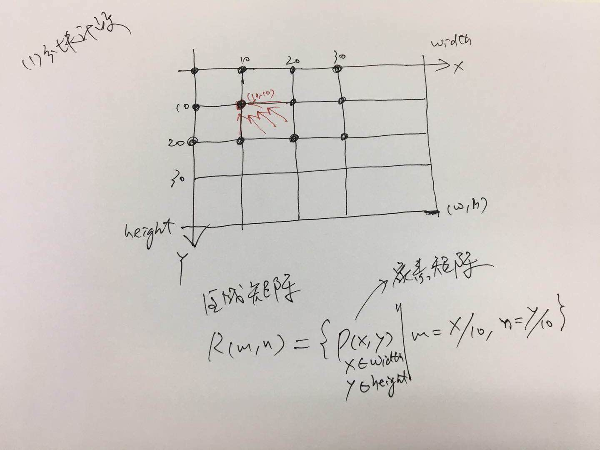
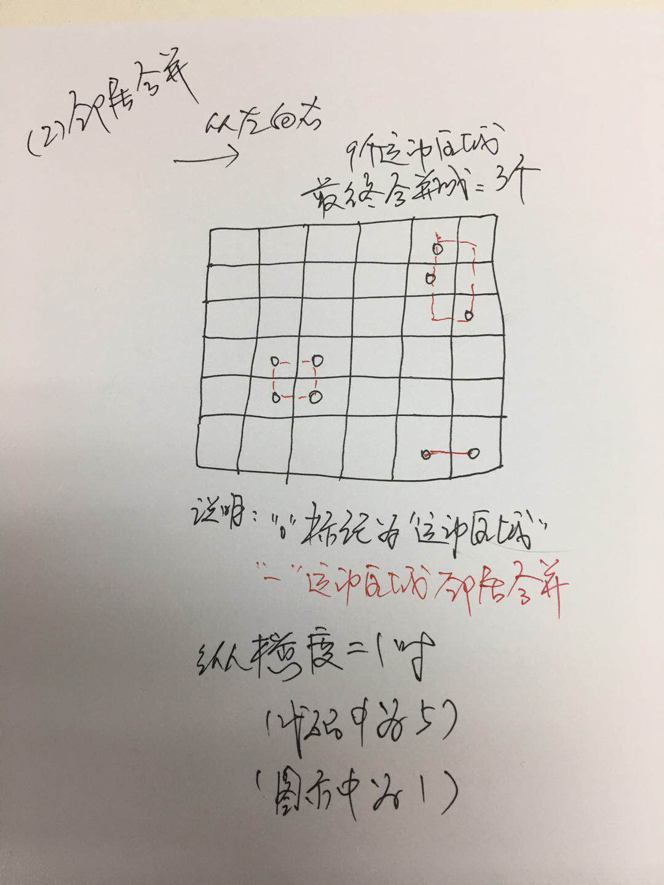

# DifferentRegions 算法

<!-- TOC depthFrom:1 depthTo:6 withLinks:1 updateOnSave:1 orderedList:0 -->

- [DifferentRegions 算法](#differentregions-算法)
	- [术语定义](#术语定义)
	- [算法描述](#算法描述)
		- [图例说明](#图例说明)
		- [分块计数代码](#分块计数代码)
		- [邻居合并代码](#邻居合并代码)
	- [代码解读](#代码解读)
	- [使用样例](#使用样例)

<!-- /TOC -->

## 术语定义

- **帧**: 帧(``Frame``) 就是从摄像头中抓出的图片。简单说帧就是图片。一个视频是有一系列连续快速播放的帧构成。
- **像素**: 像素（``pixel``） 就是帧或图片中的一个个点。一张1280*720p的图片是由横向1280*纵向720个点组成。
- **像素的颜色**: 每个像素一般由``ARGB``四个值构成，每个值占1字节（8bit），4个恰好是一个Int数。它们共同记录这个像素的颜色(RGB)和透明度（alpha）。如果不考虑压缩算法，一个图片的容量=1280*720*4B=3.5M

- **运动像素**: 一个视频的前后相邻的两帧，在同一个像素点，也叫坐标(x,y)上的RGB取值的差值，如果大于某个给定的阈值，则这个像素为运动像素。注意：一般这个差值只要RGB三个维度中的任意一个维度的差值大于阈值就算。

- **区域**: 一张图片像素太多，通常会按10*10个像素、100*100个像素划分成一个个的块，这个块叫区域。
- **区域矩阵**: 所有的区域构成的矩阵。
- **区域计数器**: 记录指定区域内运动像素的计数器。

- **运动区域**: 如果一个区域的区域计数器的取值大于某个给定的阈值（比如半数以上），就认定这个区域为运动区域。比如如果按10*10像素作为一个区域，那么区域内运动像素的个数如果大于 (10*10)/2 = 50个的话，就可以认定为运动区域。

- **区域标记**: 一个运动区域，被标记了，叫做标记区域或者区域标记。

- **邻居区域**: 一个区域纵横5个区域（上下左右延伸5个区域）构成的区域集合。


## 算法描述

有了上述的术语后，描述算法就方便了。算法步骤：

1. 区域计数：找出所有的``运动像素``，并登记到``区域计数器``里（每个像素都有且仅属于一个区域）。
2. 标记运动区域：对所有的区域，评估它是否为``运动区域``，如果是``运动区域``立即进行``区域标记``。
3. 邻居扩散：一个运动区域一旦被标记，就必须立即考察它的``邻居区域``。怎么考察？找出``邻居区域``内所有属于``运动区域``，但尚未被``标记``的。
4. 扩散收敛：不断跟邻居对比（运动区域&未被标记），把运动框框的左顶点往左靠，右底点往右靠。

思考：为什么要进行邻居扩散？
回答：为了聚集。画面里面会有很多``运动区域``，我们要把相邻的``运动区域``尽可能聚集到一起。

再进一步可以理解为2步：
- 分块计数：按10*10的块将像素矩阵划分若干块，找出每块内运动像素的数量，对于超过半数的，标记为``运动区域``。
- 邻居合并：对于所有的``运动区域``，按照纵横5个的范围进行合并。合并规则：左顶点往左靠，右底点往右靠。

### 图例说明

简单用图例说明下：

- 分块计数



- 邻居合并



### 分块计数代码

``` java
for (int y = 0; y < a_imageIn.getHeight(); y++) {
	for (int x = 0; x < a_imageIn.getWidth(); x++) {

		// 当前图片: A点
		l_redA = a_imageIn.getIntComponent0(x, y);
		l_greenA = a_imageIn.getIntComponent1(x, y);
		l_blueA = a_imageIn.getIntComponent2(x, y);

		// 比对图片：A'点
		l_redB = comparisonImage.getIntComponent0(x, y);
		l_greenB = comparisonImage.getIntComponent1(x, y);
		l_blueB = comparisonImage.getIntComponent2(x, y);

		/*
		 * 前后两张图片，在同一个点，的色差：如果大于色差阈值，则标记为发现运动像素。
		 * 对于运动像素，计数到它所在的区域。
		 * 像素P(x,y)，它所属的区域是R(x / subRegionSide, y / subRegionSide) 。
		 */
		if (Math.abs(l_redA - l_redB) > colorRange || Math.abs(l_greenA - l_greenB) > colorRange
				|| Math.abs(l_blueA - l_blueB) > colorRange) {
			// arrPixelsPerSubRegion 区域运动计数器（区域内运动像素的数量）
			// p(x,y) 像素 所属的区域 是 R(x / subRegionSide, y / subRegionSide)
			arrPixelsPerSubRegion[x / subRegionSide][y / subRegionSide]++;
		}
	}
```

### 邻居合并代码

``` java
private boolean JoinRegions(int[] a_rect) {
	for (int rx = 0; rx < width / subRegionSide; rx++) {
		for (int ry = 0; ry < height / subRegionSide; ry++) {
			/*
			 * 标记运动区域：arrRegionMask标记区域是否为运动区域
			 * 如果一个区域内超过半数的点是运动点，那么这个区域就标记为运动区域
			 * */
			if (arrPixelsPerSubRegion[rx][ry] > (subRegionSide * subRegionSide / 2) && !arrRegionMask[rx][ry]) {
				arrRegionMask[rx][ry] = true; // 标记为运动区域
				a_rect[0] = rx * subRegionSide;
				a_rect[1] = ry * subRegionSide;
				a_rect[2] = rx * subRegionSide;
				a_rect[3] = ry * subRegionSide;

				// 每当标记一个运动区域时，立即找出它的邻居区域也是运动的，但是尚未标记的
				testNeighbors(a_rect, rx, ry);
				return true;
			}
		}
	}
	return false;
}

private void testNeighbors(int[] a_rect, int rx, int ry) {
	for (int nrx = rx - 5; nrx < rx + 5; nrx++) {
		for (int nry = ry - 5; nry < ry + 5; nry++) {
			// 邻居区域：某个指定区域的纵横5个区域。也叫区域的邻居集。
			if ((nrx > 0 && nrx < width / subRegionSide) && (nry > 0 && nry < height / subRegionSide)) {
				// 对于邻居区域是运动的，但是却没有被标记的
				if (arrPixelsPerSubRegion[nrx][nry] > (subRegionSide * subRegionSide / 2) && !arrRegionMask[nrx][nry]) {

					// 跟邻居对比，左顶点往左靠
					if (nrx * subRegionSide < a_rect[0]) { // rect.x1
						a_rect[0] = nrx * subRegionSide;
					}
					if (nry * subRegionSide < a_rect[1]) { // rect.y1
						a_rect[1] = nry * subRegionSide;
					}

					// 跟邻居对比，右底点往右靠
					if (nrx * subRegionSide > a_rect[2]) { // rect.x2
						a_rect[2] = nrx * subRegionSide;
					}
					if (nry * subRegionSide > a_rect[3]) { // rect.y2
						a_rect[3] = nry * subRegionSide;
					}

					// 把邻居区域标记为运动区域
					arrRegionMask[nrx][nry] = true;

					// 每当标记一个运动区域时，立即找出它的邻居区域也是运动的，但是尚未标记的
					testNeighbors(a_rect, nrx, nry);
				}
			}
		}
	}
}
```

## 代码解读

注释版代码 [DifferentRegionsComments.java](../../MarvinPlugins/src/main/java/org/marvinproject/image/difference/differentRegions/DifferentRegionsComments.java) 如下：

``` java
import java.util.Vector;

import marvin.gui.MarvinAttributesPanel;
import marvin.image.MarvinImage;
import marvin.image.MarvinImageMask;
import marvin.plugin.MarvinAbstractImagePlugin;
import marvin.util.MarvinAttributes;

/**
 * Find the different regions between two images.
 *
 * @author Gabriel Ambrosio Archanjo
 */
public class DifferentRegionsComments extends MarvinAbstractImagePlugin {

	private MarvinAttributes attributes;
	private MarvinImage comparisonImage;

	private int[][] arrPixelsPerSubRegion;
	private boolean[][] arrRegionMask;

	private int width;
	private int height;

	/** 色差阈值：前后两张图片在同一个点，如果色差大于阈值，则计为运动点 */
	private int colorRange = 30;

	/* 区域粒度：将一张图片，按10像素*10像素 的方框去切割 */
	private int subRegionSide = 10;

	private boolean initialized = false;

	public void load() {
		attributes = getAttributes();
		attributes.set("colorRange", 30);
	}

	public MarvinAttributesPanel getAttributesPanel() {
		return null;
	}

	public void process(MarvinImage a_imageIn, MarvinImage a_imageOut, MarvinAttributes a_attributesOut,
			MarvinImageMask a_mask, boolean a_previewMode) {
		int l_redA, l_redB, l_greenA, l_greenB, l_blueA, l_blueB;

		comparisonImage = (MarvinImage) attributes.get("comparisonImage");
		colorRange = (Integer) attributes.get("colorRange");
		width = a_imageIn.getWidth();
		height = a_imageIn.getHeight();

		if (!initialized) {
			// 10*10的像素方块定义为一个区域，它的取值表示这个区域内运动点的强度
			arrPixelsPerSubRegion = new int[width / subRegionSide][height / subRegionSide];
			// 区域状态标记：false表示未被标记，true表示被标记。被标记表示这个点运动了。
			arrRegionMask = new boolean[width / subRegionSide][height / subRegionSide];
			initialized = true;
		}

		clearRegions();

		for (int y = 0; y < a_imageIn.getHeight(); y++) {
			for (int x = 0; x < a_imageIn.getWidth(); x++) {

				// 当前图片: A点
				l_redA = a_imageIn.getIntComponent0(x, y);
				l_greenA = a_imageIn.getIntComponent1(x, y);
				l_blueA = a_imageIn.getIntComponent2(x, y);

				// 比对图片：A'点
				l_redB = comparisonImage.getIntComponent0(x, y);
				l_greenB = comparisonImage.getIntComponent1(x, y);
				l_blueB = comparisonImage.getIntComponent2(x, y);

				/*
				 * 前后两张图片，在同一个点，的色差：如果大于色差阈值，则标记为发现运动像素。
				 * 对于运动像素，计数到它所在的区域。
				 * 像素P(x,y)，它所属的区域是R(x / subRegionSide, y / subRegionSide) 。
				 */
				if (Math.abs(l_redA - l_redB) > colorRange || Math.abs(l_greenA - l_greenB) > colorRange
						|| Math.abs(l_blueA - l_blueB) > colorRange) {
					// arrPixelsPerSubRegion 区域运动计数器（区域内运动像素的数量）
					arrPixelsPerSubRegion[x / subRegionSide][y / subRegionSide]++;
				}
			}
		}

		// 中间结果 arrPixelsPerSubRegion 区域计数器记录了每个区域的运动像素个数

		Vector<int[]> l_vecRegions = new Vector<int[]>();
		int[] l_rect;

		while (true) {
			l_rect = new int[4];
			l_rect[0] = -1;

			JoinRegions(l_rect);
			if (l_rect[0] != -1) {
				l_vecRegions.add(l_rect);
			} else {
				break;
			}
		}
		a_attributesOut.set("regions", l_vecRegions);
	}

	private boolean JoinRegions(int[] a_rect) {
		for (int rx = 0; rx < width / subRegionSide; rx++) {
			for (int ry = 0; ry < height / subRegionSide; ry++) {
				/*
				 * 标记运动区域：arrRegionMask标记区域是否为运动区域
				 * 如果一个区域内超过半数的点是运动点，那么这个区域就标记为运动区域
				 * */
				if (arrPixelsPerSubRegion[rx][ry] > (subRegionSide * subRegionSide / 2) && !arrRegionMask[rx][ry]) {
					arrRegionMask[rx][ry] = true; // 标记为运动区域
					a_rect[0] = rx * subRegionSide;
					a_rect[1] = ry * subRegionSide;
					a_rect[2] = rx * subRegionSide;
					a_rect[3] = ry * subRegionSide;

					// 每当标记一个运动区域时，立即找出它的邻居区域也是运动的，但是尚未标记的
					testNeighbors(a_rect, rx, ry);
					return true;
				}
			}
		}
		return false;
	}

	private void testNeighbors(int[] a_rect, int rx, int ry) {
		for (int nrx = rx - 5; nrx < rx + 5; nrx++) {
			for (int nry = ry - 5; nry < ry + 5; nry++) {
				// 邻居区域：某个指定区域的纵横5个区域。也叫区域的邻居集。
				if ((nrx > 0 && nrx < width / subRegionSide) && (nry > 0 && nry < height / subRegionSide)) {
					// 对于邻居区域是运动的，但是却没有被标记的
					if (arrPixelsPerSubRegion[nrx][nry] > (subRegionSide * subRegionSide / 2) && !arrRegionMask[nrx][nry]) {

						// 跟邻居对比，左顶点往左靠
						if (nrx * subRegionSide < a_rect[0]) { // rect.x1
							a_rect[0] = nrx * subRegionSide;
						}
						if (nry * subRegionSide < a_rect[1]) { // rect.y1
							a_rect[1] = nry * subRegionSide;
						}

						// 跟邻居对比，右底点往右靠
						if (nrx * subRegionSide > a_rect[2]) { // rect.x2
							a_rect[2] = nrx * subRegionSide;
						}
						if (nry * subRegionSide > a_rect[3]) { // rect.y2
							a_rect[3] = nry * subRegionSide;
						}

						// 把邻居区域标记为运动区域
						arrRegionMask[nrx][nry] = true;

						// 每当标记一个运动区域时，立即找出它的邻居区域也是运动的，但是尚未标记的
						testNeighbors(a_rect, nrx, nry);
					}
				}
			}
		}
	}

	private void clearRegions() {
		for (int x = 0; x < width / subRegionSide; x++) {
			for (int y = 0; y < height / subRegionSide; y++) {
				arrPixelsPerSubRegion[x][y] = 0;
				arrRegionMask[x][y] = false;
			}
		}
	}
}

```

## 使用样例

完整可运行代码见：[MotionDetectionCoupling.java](../src/main/java/video/detectMotionRegions/MotionDetectionCoupling.java)

``` java
MarvinImage originalFrame = videoInterface.getFrame(); // 输入图片
MarvinImage.copyColorArray(originalFrame, filteredImage); // 输出图片：默认不做加工
// 设置输入参数
motionDetectPlugin.setAttribute("comparisonImage", lastFrame);
motionDetectPlugin.setAttribute("colorRange", sensibilityValue); // 色差值
MarvinAttributes attributesOut = new MarvinAttributes(null);

// 加工后的图片存放在filteredImage，结果通过 attributesOut 返回
motionDetectPlugin.process(originalFrame, filteredImage, attributesOut, MarvinImageMask.NULL_MASK, false);

// 标记出运动区域，每个区域用``int[]``表示，分别是：x1, y1, x2, y2 （左上顶点，右下顶点）
Vector<int[]> motionRegions = (Vector<int[]>) attributesOut.get("regions");
```
