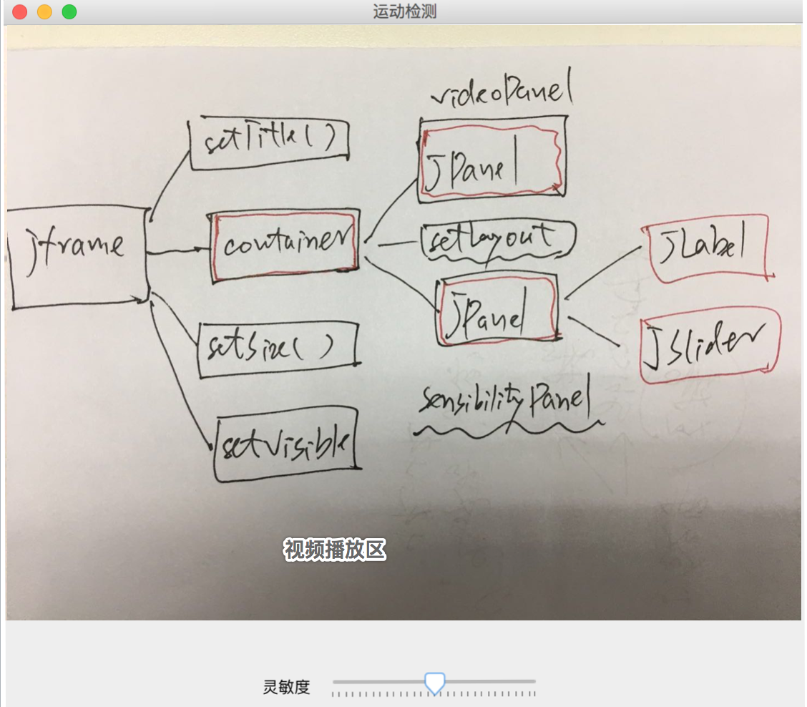

# 运动检测

``运动检测``指的是当一个视频里面出现了运动的物体，程序会把运动的地方标记出来。它常用在摄像头监控领域，比如夜间值守，通常是没有人的，但是如果监控画面出现物体晃动，则发出警报。


## 运动检测样例代码

代码 [MotionDetectionCoupling.java](../src/main/java/video/detectMotionRegions/MotionDetectionCoupling.java)

### 视频播放原理

``` java
MarvinVideoInterface videoInterface = new MarvinJavaCVAdapter(); // 摄像头
videoInterface.connect(0); // cam on iOS

while (true) { // 不停的抓图&贴图

  MarvinImage originalFrame = videoInterface.getFrame(); // 从摄像头抓1帧图像
  MarvinImage.copyColorArray(originalFrame, filteredImage); // 复制到 filteredImage

  // 对filteredImage加工处理

  videoImagePanel.setImage(filteredImage); // 贴图：把图片贴到JPanel上
}
```

>视频播放的原理就是动图：不停的从摄像头抓图，然后贴图到JPanel上，人眼就以为是视频了。


### 样例代码UI结构



整个UI是一个``JFrame``，它上面有两个``JPanel``，一个用来存放视频（确切说是图片），另一个用来存放``JLabel``和``JSlider``的集合体。

### MotionDetectionCoupling代码讲解

简单说就是在UI上有一个``JPanel``用来存放图片，这张图片会被一个叫``motion-detection``的线程不断的覆盖，以实现视频效果。``motion-detection``的主要逻辑是：(1)从摄像头抓取图片；（2）用DifferentRegions插件对图片处理，并返回运动区域；（3）对运动区域画一个矩形，以便在图片上标记出来。

``` java
Vector<int[]> motionRegions = (Vector<int[]>) attributesOut.get("regions");
					for (int i = 0; i < motionRegions.size(); i++) {
						int[] region = motionRegions.get(i);

						// (x1, y1) 是矩形的左上顶点；(x2, y2) 是矩形的右下顶点
						int x1 = region[0];
						int y1 = region[1];
						int x2 = region[2];
						int y2 = region[3];

						int width = x2 - x1;
						int height = y2 - y1;

						filteredImage.drawRect(x1, y1, // x, y
								width,height, // w, h
								2, // 线条粗细为2个像素
								Color.GREEN);

					}
```

----

## DifferentRegions插件

### MarvinPlugin机制

``Marvin``整体架构分三层：底层的``MarvinFramework``；中间的拓展层``MarvinPlugin`` 和 顶层的应用层。就是本项目的``MarvinSample``。
``MarvinPlugin``抽象的回调接口就是``MarvinImagePlugin.process()``方法：

``` java
public interface MarvinImagePlugin extends MarvinPlugin {

  // 输入 Attributes
  public void setAttribute(String attrName, Object value);
  public Object getAttribute(String attrName);

  // 插件处理回调方法
  public void process  (
		MarvinImage imgIn,  // 输入图片
		MarvinImage imgOut, // 输出图片：返回插件的处理结果之图片部分
		MarvinAttributes attrOut, // 输出属性：返回插件的处理结果之数据部分
		MarvinImageMask mask,
		boolean previewMode
	);

}
```

这个接口大致说明了一个插件的处理逻辑：输入一张图片，输出一张图片。有时候，图片处理需要一些额外的参数，则通过``MarvinImagePlugin.setAttribute``传入；有时候除了输出一张图片外，还会输出其他结构化数据，可以通过``MarvinAttributes attrOut``返回。

### DifferentRegions使用

``` java
MarvinImage originalFrame = videoInterface.getFrame(); // 输入图片
MarvinImage.copyColorArray(originalFrame, filteredImage); // 输出图片：默认不做加工
// 设置输入参数
motionDetectPlugin.setAttribute("comparisonImage", lastFrame);
motionDetectPlugin.setAttribute("colorRange", sensibilityValue);
MarvinAttributes attributesOut = new MarvinAttributes(null);

// 加工后的图片存放在filteredImage，结果通过 attributesOut 返回
motionDetectPlugin.process(originalFrame, filteredImage, attributesOut, MarvinImageMask.NULL_MASK, false);

// 标记出运动区域，每个区域用``int[]``表示，分别是：x1, y1, x2, y2 （左上顶点，右下顶点）
Vector<int[]> motionRegions = (Vector<int[]>) attributesOut.get("regions");
```

### DifferentRegions原理
